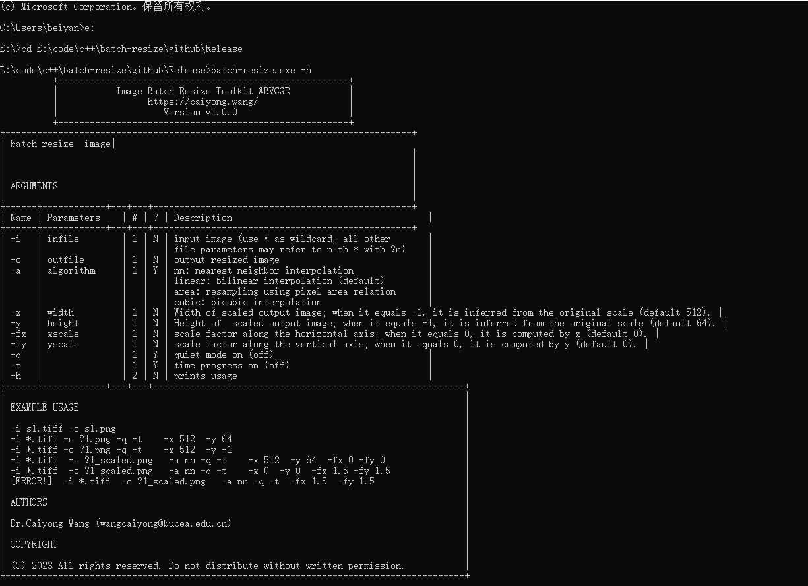

# batch-resize
A batch resize tool for batch resizing the image 
# Usage

1. Download all files from [https://github.com/xiamenwcy/batch-resize](https://github.com/xiamenwcy/batch-resize) and unzip Release.zip
2. Open the **CMD** from start menu, and enter the folder of the executable file **‘batch-resize.exe’**
3. Open **help** menu and read all commands

> batch-resize.exe -h

4. Begin to batch resize your images! Just enjoy it! :blush::blush:

